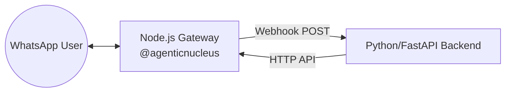

# Multi-tenant WhatsApp Library for AI Agents

Powered by **WEBLIFETECH** and designed for **AI Agent** orchestrations por @jonnathanypg.

## 👨‍💻 Author and Creator

**Jonnathan Peña**
* Lead Architect & Original Creator
* [GitHub](https://github.com/jonnathanypg)
* [LinkedIn](https://www.linkedin.com/in/jonnathanypg/)

---

## 🚀 Features

- **Multi-tenant**: Handle multiple WhatsApp sessions simultaneously.
- **AI Ready**: Easy integration with AI agent backends via webhooks.
- **Stable**: Validated for production SaaS environments.
- **Persistence**: MySQL support for session management.
- **Microservice & Library**: Can be run as a standalone service or imported as a library.

## 🏗 Architecture (Gateway Pattern)

This library is designed to work as a **WhatsApp Gateway**. It handles the complex WhatsApp socket connection and provides a simple HTTP interface for your AI backends (Python, Go, PHP, etc.).



### 1. Receiving Messages (Node -> Python)
When a message arrives at the Gateway, it will perform a `POST` request to your `BACKEND_URL` (defined in `.env`).

**Python (FastAPI) Example:**
```python
from fastapi import FastAPI, Request

app = FastAPI()

@app.post("/webhooks/whatsapp")
async def handle_whatsapp(request: Request):
    data = await request.json()
    print(f"Message from {data['from']}: {data['message']}")
    return {"status": "received"}
```

### 2. Sending Messages (Python -> Node)
To send a message, your Python backend simply calls the Gateway's API.

**Python Example:**
```python
import requests

payload = {
    "phone": "5491112345678",
    "message": "Hello from Python!",
    "companyId": "your_company_id" # Optional
}

response = requests.post("http://localhost:3001/lead", json=payload)
print(response.json())
```

---

## 📦 Installation

```bash
npm install @agenticnucleus/whatsapp-multitenant
```

## 🛠 Usage Modes

### Mode A: Standalone Gateway (Recommended for Python/Other)
This is the fastest way. You don't even need to code in Node.js.

1. Create a folder and a `.env` file with your MySQL and Backend URL.
2. Run directly:
```bash
npx @agenticnucleus/whatsapp-multitenant
```
The gateway will start instantly on port 3001.

### Mode B: Library Mode (Node.js Only)
If you want to integrate it directly into your Node.js app:
```typescript
import { BaileysTransporter } from '@agenticnucleus/whatsapp-multitenant';

const transporter = new BaileysTransporter();
await transporter.initialize();
```

## 🤝 Contributing

We love community contributions! If you want to contribute, please check our [Contributing Guide](CONTRIBUTING.md) and use our [PR Template](.github/PULL_REQUEST_TEMPLATE.md).

1. Fork the project.
2. Create your Feature Branch (`git checkout -b feature/AmazingFeature`).
3. Commit your changes (`git commit -m 'Add some AmazingFeature'`).
4. Push to the Branch (`git push origin feature/AmazingFeature`).
5. Open a Pull Request.

## ⚖️ License

Distributed under the MIT License. See `LICENSE` for more information.

---

*This is an Open Source library. Please ensure you maintain the original author credits when using or mentioning this architecture.*