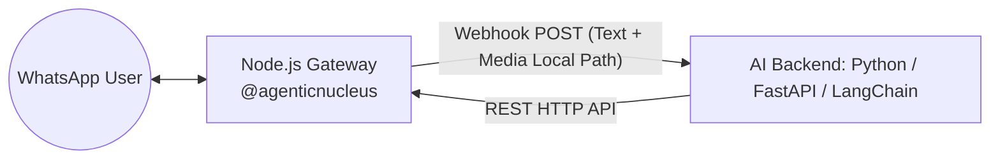

# Multi-tenant WhatsApp Library & Gateway for AI Agents

> **¿Te gusta este proyecto?** ¡Regálanos una ⭐ en GitHub para apoyarnos y que más gente conozca la librería!  
> * [GitHub Repository](https://github.com/agenticnucleus/whatsapp-multitenant)  
> * [NPM Package](https://www.npmjs.com/package/@agenticnucleus/whatsapp-multitenant)

Powered by **WEBLIFETECH** and designed for **AI Agent** orchestrations por @jonnathanypg.

## 👨‍💻 Author and Creator

**Jonnathan Peña**
* Lead Architect & Original Creator
* [GitHub](https://github.com/jonnathanypg)
* [LinkedIn](https://www.linkedin.com/in/jonnathanypg/)

---

## 🚀 Key Features (Production Grade)

- **Multi-tenant**: Maneja múltiples números y empresas de WhatsApp concurrentemente de forma aislada.
- **Ultra-Resilient MySQL Auth State**:
  - In-Memory Cache (O(1)) para llaves criptográficas de Baileys para evitar agotar pools de conexiones remotas (Hostinger, AWS RDS, GCP).
  - Consultas e inserciones en batch masivo (`WHERE pk_id IN (?)` y `INSERT ... ON DUPLICATE KEY UPDATE`).
- **Dynamic WhatsApp Web Handshake**: Detección automática y dinámica de versión de WhatsApp para evitar errores de desconexión `405` o logouts repentinos.
- **Smart JID & LID Resolver**:
  - Caché de destinatarios y normalización telefónica internacional automática (Ecuador, México, Colombia, España, USA, Argentina, etc.).
  - Soporte nativo para números con `@lid` de WhatsApp Multi-dispositivo.
- **Full Media Support**: Envío y recepción de imágenes, audios (con formato PTT / notas de voz) y documentos (PDF, Excel, CSV) con descarga automática para webhooks.
- **Auto-Restoration & Clean Session Cycle**: Restauración automática de sesiones desde MySQL al reiniciar y reseteo forzado (`forceNew: true`) en caso de rotación de chip o credenciales corruptas.
- **Dual Mode**: Úsalo como **Gateway Microservice** autónomo (HTTP / Webhook para Python/FastAPI/Go/PHP) o como **Librería NPM** programática en TypeScript / Node.js.

---

## 🏗 Architecture (Gateway Pattern)


```mermaid
graph LR
    User((WhatsApp User)) <--> Gateway[Node.js Gateway<br/>@agenticnucleus]
    Gateway -- Webhook POST (Text + Media Local Path) --> Backend[AI Backend: Python / FastAPI / LangChain]
    Backend -- REST HTTP API --> Gateway
```

### 1. Receiving Messages & Media (Gateway -> Backend Webhook)
Cuando llega un mensaje, el Gateway realiza un `POST` a tu `BACKEND_URL` (por defecto `http://localhost:5000/webhooks/whatsapp` o según tu `.env`):

**Webhook Payload Structure:**
```json
{
  "companyId": "empresa_123",
  "from": "593999999999",
  "fromJid": "593999999999@s.whatsapp.net",
  "fromName": "Carlos Mendoza",
  "message": "Hola, adjunto mi factura",
  "messageId": "BAE5F123456789",
  "attachment": {
    "type": "document",
    "mimetype": "application/pdf",
    "filename": "factura.pdf",
    "caption": "",
    "local_path": "/path/to/uploads/1710000000_factura.pdf"
  }
}
```

### 2. Sending Messages & Media (Backend -> Gateway)

#### Enviar Texto
```bash
POST http://localhost:3001/lead
Content-Type: application/json

{
  "companyId": "empresa_123",
  "phone": "+593 99 999 9999",
  "message": "Hola! Tu cita está confirmada."
}
```

#### Enviar Multimedia (Imágenes, Videos, Audios PTT, PDFs, Excel)
```bash
POST http://localhost:3001/lead/media
Content-Type: application/json

{
  "companyId": "empresa_123",
  "phone": "593999999999",
  "mediaType": "document",
  "mediaUrl": "https://tuservidor.com/archivos/reporte.pdf",
  "fileName": "reporte.pdf",
  "caption": "Adjunto tu reporte mensual"
}
```

#### Indicador "Escribiendo..." / Typing
```bash
POST http://localhost:3001/lead/typing
Content-Type: application/json

{
  "companyId": "empresa_123",
  "phone": "593999999999"
}
```

---

## 📱 Session Management API

| Método | Endpoint | Descripción |
|---|---|---|
| `POST` | `/session/init` | Inicia o reactiva una sesión. Opcional: `{"companyId": "1", "forceNew": true}` |
| `GET` | `/session/qr/:companyId` | Obtiene el QR en formato SVG para escanear en WhatsApp. |
| `GET` | `/session/status/:companyId` | Consulta el estado en memoria (`connected`, `phone`, etc.). |
| `GET` | `/session/status-restore/:companyId`| Consulta estado e intenta auto-restaurar desde MySQL si estaba inactiva. |
| `POST` | `/session/logout` | Cierra sesión y purga las credenciales de la base de datos de esa empresa. |
| `GET` | `/session/list` | Lista todas las empresas activas y su estado de conexión. |

---

## 📦 Installation & Usage

```bash
npm install @agenticnucleus/whatsapp-multitenant
```

### Modo A: Standalone Gateway (Recomendado para Python/Agentes IA)
1. Crea un directorio y define tu `.env`:
```env
PORT=3001
DB_HOST=localhost
DB_PORT=3306
DB_USER=root
DB_PASSWORD=secret
DB_NAME=whatsapp_gateway
BACKEND_URL=http://localhost:5000
WEBHOOK_PATH=/webhooks/whatsapp
```

2. Ejecuta directamente el gateway:
```bash
npx @agenticnucleus/whatsapp-multitenant
# o habiendo instalado globalmente:
whatsapp-gateway
```

### Modo B: Librería en Código (TypeScript / Node.js)
```typescript
import { 
  BaileysTransporter, 
  useMySQLAuthState, 
  deleteSessionAuth 
} from '@agenticnucleus/whatsapp-multitenant';

const transporter = new BaileysTransporter();

// Inicializa y auto-restaura sesiones existentes en MySQL
await transporter.initialize();

transporter.on("message", ({ companyId, message }) => {
  console.log(`Mensaje recibido para ${companyId}:`, message);
});

// Enviar mensaje
await transporter.sendMsg({
  companyId: "empresa_1",
  phone: "593991234567",
  message: "¡Hola desde la librería!"
});
```

---

## 🤝 Contributing

We love community contributions! If you want to contribute, please check our [Contributing Guide](CONTRIBUTING.md) and use our [PR Template](.github/PULL_REQUEST_TEMPLATE.md).

1. Fork the project.
2. Create your Feature Branch (`git checkout -b feature/AmazingFeature`).
3. Commit your changes (`git commit -m 'Add some AmazingFeature'`).
4. Push to the Branch (`git push origin feature/AmazingFeature`).
5. Open a Pull Request.

## ⚖️ License

Distributed under the MIT License. See `LICENSE` for more information.

---

*This is an Open Source library. Please ensure you maintain the original author credits when using or mentioning this architecture.*